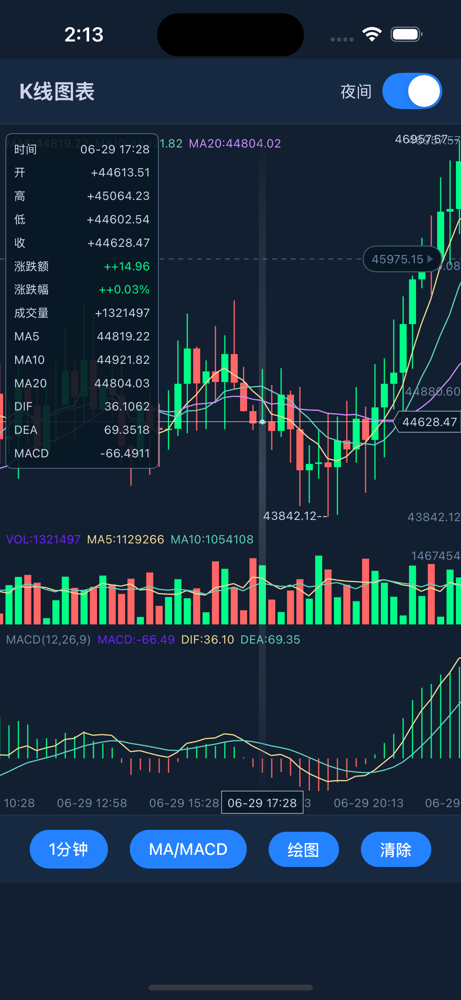
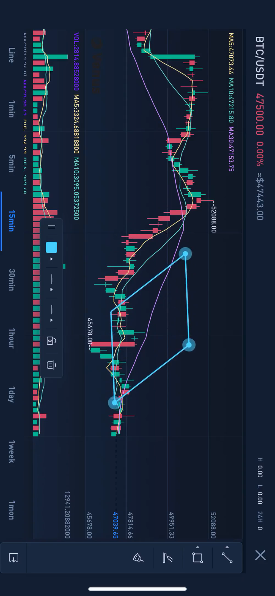

# React Native K线图表库

<div align="center">
  
  [](https://opensource.org/licenses/Apache-2.0)
  [](https://reactnative.dev)
  
  **专业的React Native K线（蜡烛图）图表库**
  
  *超流畅渲染 • 交互式绘图工具 • 多种技术指标 • 深色/浅色主题*
  
  [English](./README.md) | 中文文档
</div>

## 🌟 功能特性

### 📈 **高级图表功能**
- ✅ **超流畅滚动** - 原生性能优化，60fps丝滑体验
- ✅ **手势缩放** - 流畅的双指缩放识别  
- ✅ **长按详情** - 动画信息面板显示详细数据
- ✅ **实时更新** - 高效数据管理和更新机制
- ✅ **多时间周期** (1分钟、5分钟、15分钟、30分钟、1小时、4小时、1天、1周)

### 📊 **技术分析指标**
- ✅ **主图指标**: MA（移动平均线）、BOLL（布林带）
- ✅ **副图指标**: MACD、KDJ、RSI、WR
- ✅ **自定义参数** - 所有指标支持参数调整
- ✅ **多彩指标线** - 平滑动画效果
- ✅ **成交量分析** - 专用成交量图表显示

### ✏️ **交互式绘图工具**
- ✅ **趋势线** - 对角线支撑阻力分析
- ✅ **水平线** - 价格水平标记
- ✅ **垂直线** - 时间事件标记
- ✅ **矩形** - 范围高亮显示
- ✅ **文本标注** - 自定义标签和注释
- ✅ **绘图持久化** - 触摸编辑功能

### 🎨 **视觉效果**
- ✅ **深色/浅色主题** - 即时切换，无缝过渡
- ✅ **渐变背景** - 增强视觉吸引力
- ✅ **自定义颜色** - 所有图表元素完全可定制
- ✅ **响应式设计** - 支持横竖屏自动适配
- ✅ **高DPI支持** - 所有设备清晰渲染

### 📱 **平台支持**
- ✅ **iOS & Android** - 平台特定优化
- ✅ **React Native 新架构** 兼容
- ✅ **Fabric 渲染器** 支持，增强性能
- ✅ **TypeScript** 类型定义包含

## 🚀 性能演示

<div align="center">
  
  
  
  
  *60fps 流畅滚动、缩放和绘图操作*
</div>

## 📦 安装

```bash
# 使用 npm
npm install react-native-kline-view

# 使用 yarn
yarn add react-native-kline-view

# 开发版本
yarn add https://github.com/hellohublot/react-native-kline-view.git
```

### iOS 配置
```bash
cd ios && pod install
```

### Android 配置
Android 无需额外配置。

## 🎯 快速开始

### 基础用法

查看完整的实现示例，请参考 **[example/App.js](./example/App.js)**

示例应用展示了：
- 🎛️ **完整UI控件** - 时间周期选择器、指标切换器、绘图工具
- 🎨 **主题管理** - 深色/浅色模式平滑过渡  
- 📊 **指标管理** - 动态指标切换和配置
- ✏️ **绘图工具** - 全功能绘图界面和工具选择
- 📱 **响应式设计** - 适配不同屏幕尺寸和方向

## 📊 组件属性

### 核心属性

| 属性 | 类型 | 必需 | 默认值 | 描述 |
|----------|------|----------|---------|-------------|
| `optionList` | string | ✅ | - | 包含所有图表配置和数据的JSON字符串 |
| `onDrawItemDidTouch` | function | ❌ | - | 当绘图项目被触摸时的回调 |
| `onDrawItemComplete` | function | ❌ | - | 当绘图项目完成时的回调 |
| `onDrawPointComplete` | function | ❌ | - | 当绘图点完成时的回调 |

### 事件回调详情

| 回调函数 | 参数 | 描述 |
|----------|------------|-------------|
| `onDrawItemDidTouch` | `{ shouldReloadDrawItemIndex, drawColor, drawLineHeight, drawDashWidth, drawDashSpace, drawIsLock }` | 用户触摸现有绘图项目时触发，返回绘图属性用于编辑 |
| `onDrawItemComplete` | `{}` | 用户完成创建新绘图项目时触发 |
| `onDrawPointComplete` | `{ pointCount }` | 用户完成向绘图添加点时触发（对多点绘图有用） |

## 🔧 OptionList 配置

`optionList` 是包含所有图表配置的JSON字符串。完整的结构如下：

### 主要配置

| 属性 | 类型 | 默认值 | 描述 |
|----------|------|---------|-------------|
| `modelArray` | Array | `[]` | K线数据数组（见下方数据格式） |
| `shouldScrollToEnd` | Boolean | `true` | 加载时是否滚动到最新数据 |
| `targetList` | Object | `{}` | 技术指标参数 |
| `configList` | Object | `{}` | 视觉样式配置 |
| `drawList` | Object | `{}` | 绘图工具配置 |

### 数据格式 (modelArray)

每个数据点应包含以下字段：
- `id`: 时间戳
- `open`: 开盘价
- `high`: 最高价
- `low`: 最低价
- `close`: 收盘价
- `vol`: 成交量
- `dateString`: 格式化时间字符串
- `selectedItemList`: 信息面板数据数组
- `maList`: 移动平均线数据（如果启用）
- `maVolumeList`: 成交量移动平均线数据
- 各种技术指标数据（MACD、KDJ、RSI等）

### 视觉配置 (configList)

| 属性 | 类型 | 描述 |
|----------|------|-------------|
| `colorList` | Object | `{ increaseColor, decreaseColor }` - 涨跌颜色 |
| `targetColorList` | Array | 指标线颜色数组 |
| `backgroundColor` | Color | 图表背景色 |
| `textColor` | Color | 全局文字颜色 |
| `gridColor` | Color | 网格线颜色 |
| `candleTextColor` | Color | 蜡烛标签文字颜色 |
| `minuteLineColor` | Color | 分时图线条颜色 |
| `minuteGradientColorList` | Array | 分时图背景渐变色 |
| `minuteGradientLocationList` | Array | 渐变停止位置 [0, 0.3, 0.6, 1] |
| `mainFlex` | Number | 主图高度比例 (0.6 - 0.85) |
| `volumeFlex` | Number | 成交量图高度比例 (0.15 - 0.25) |
| `paddingTop` | Number | 顶部内边距（像素） |
| `paddingBottom` | Number | 底部内边距（像素） |
| `paddingRight` | Number | 右侧内边距（像素） |
| `itemWidth` | Number | 每根蜡烛总宽度（包括边距） |
| `candleWidth` | Number | 实际蜡烛体宽度 |
| `fontFamily` | String | 所有文字的字体 |
| `headerTextFontSize` | Number | 标题文字大小 |
| `rightTextFontSize` | Number | 右轴文字大小 |
| `candleTextFontSize` | Number | 蜡烛数值文字大小 |
| `panelTextFontSize` | Number | 信息面板文字大小 |
| `panelMinWidth` | Number | 信息面板最小宽度 |

### 绘图配置 (drawList)

| 属性 | 类型 | 描述 |
|----------|------|-------------|
| `drawType` | Number | 当前绘图工具类型 (0=无, 1=趋势线, 2=水平线等) |
| `shouldReloadDrawItemIndex` | Number | 绘图状态管理 |
| `drawShouldContinue` | Boolean | 完成一个项目后是否继续绘图 |
| `shouldClearDraw` | Boolean | 清除所有绘图的标志 |
| `shouldFixDraw` | Boolean | 完成当前绘图的标志 |
| `shotBackgroundColor` | Color | 绘图覆盖层背景色 |

### 技术指标配置 (targetList)

包含各种技术指标的参数设置：

**移动平均线设置**：
- `maList`: MA线配置数组
- `maVolumeList`: 成交量MA配置

**布林带参数**：
- `bollN`: 周期 (默认 "20")
- `bollP`: 标准差倍数 (默认 "2")

**MACD参数**：
- `macdS`: 快线EMA周期 (默认 "12")
- `macdL`: 慢线EMA周期 (默认 "26") 
- `macdM`: 信号线周期 (默认 "9")

**KDJ参数**：
- `kdjN`: 周期 (默认 "9")
- `kdjM1`: K值平滑 (默认 "3")
- `kdjM2`: D值平滑 (默认 "3")

**RSI和WR设置**：
- `rsiList`: RSI配置数组
- `wrList`: WR配置数组

**查看完整配置示例，请参考 [example/App.js](./example/App.js)**

## 📄 许可证

本项目基于 Apache License 2.0 许可证 - 查看 [LICENSE](./LICENSE) 文件了解详情。

## 🙏 致谢

本项目是对 [@tifezh](https://github.com/tifezh) 的原始 [KChartView](https://github.com/tifezh/KChartView) 的重大演进和增强。虽然受到原始Android专用库的启发，但这个React Native实现已经被完全重写，包含了许多额外功能：

### 相比原项目的主要增强
- ✅ **跨平台支持** - iOS 和 Android
- ✅ **React Native 集成** - 原生桥接实现
- ✅ **交互式绘图工具** - 完整的多工具绘图系统
- ✅ **高级主题** - 深色/浅色模式平滑切换
- ✅ **性能增强** - 优化为60fps滚动和缩放
- ✅ **现代UI组件** - 模态选择器和响应式设计
- ✅ **TypeScript 支持** - 完整类型定义
- ✅ **多时间框架** - 全面的时间周期支持
- ✅ **手势增强** - 高级触摸处理和绘图交互
- ✅ **实时更新** - 高效数据流和更新
- ✅ **专业指标** - 扩展的技术分析能力

代码库已完全重写以：
- 适配React Native的架构和桥接系统
- 使用Swift和Objective-C实现iOS支持
- 添加原版中不存在的综合绘图功能
- 提供现代化的专业交易界面
- 为移动设备优化性能
- 支持React Native的新旧架构

虽然我们尊重原项目的启发，但此实现代表了为现代React Native应用和专业交易界面优化的完全重新构想。

## 📞 支持

- 📧 **邮箱**: hublot@aliyun.com
- 💬 **问题**: [GitHub Issues](https://github.com/hellohublot/react-native-kline-view/issues)
- 🎯 **示例**: 查看 [example/App.js](./example/App.js) 获取全面的使用方法

---

<div align="center">
  <p><strong>为React Native社区用❤️构建</strong></p>
  <p>
    <a href="#-功能特性">功能特性</a> •
    <a href="#-安装">安装</a> •
    <a href="#-快速开始">快速开始</a> •
    <a href="#-组件属性">API</a> •
    <a href="#-许可证">许可证</a>
  </p>
</div> 