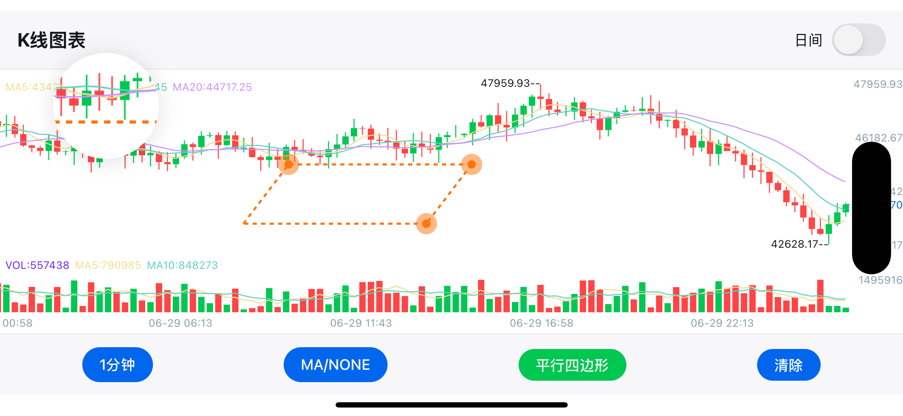

# React Native KLine View

<div align="center">
  
</div>

**Professional K-Line (Candlestick) Chart Library for React Native**
  
*Ultra-smooth rendering • Interactive drawing tools • Multiple technical indicators • Dark/Light themes*
  
English | [中文文档](./README.cn.md)

[](https://www.apache.org/licenses/LICENSE-2.0)
[](https://reactnative.dev)

React Native KLine View is a high-performance, feature-rich candlestick chart component designed for professional trading applications. Built with native optimization for both iOS and Android, it delivers smooth 60fps scrolling, zooming, and real-time data updates.

Perfect for cryptocurrency exchanges, stock trading apps, financial dashboards, and any application requiring professional-grade market data visualization.

## 🌟 Features

### 📈 **Advanced Charting**
- ✅ **Ultra-smooth scrolling** with native performance optimization
- ✅ **Pinch-to-zoom** with fluid gesture recognition  
- ✅ **Long-press details** with animated info panels
- ✅ **Real-time updates** with efficient data management
- ✅ **Multiple timeframes** (1m, 5m, 15m, 30m, 1h, 4h, 1d, 1w)

### 📊 **Technical Analysis**
- ✅ **Main Chart Indicators**: MA (Moving Average), BOLL (Bollinger Bands)
- ✅ **Sub Chart Indicators**: MACD, KDJ, RSI, WR
- ✅ **Customizable parameters** for all indicators
- ✅ **Multi-color indicator lines** with smooth animations
- ✅ **Volume analysis** with dedicated volume chart

### ✏️ **Interactive Drawing Tools**
- ✅ **Trend Lines** - Diagonal support/resistance analysis
- ✅ **Horizontal Lines** - Price level marking
- ✅ **Vertical Lines** - Time-based event marking
- ✅ **Rectangles** - Range highlighting
- ✅ **Text Annotations** - Custom labels and notes
- ✅ **Drawing persistence** with touch-to-edit functionality

### 🎨 **Visual Excellence**
- ✅ **Dark/Light themes** with instant switching
- ✅ **Gradient backgrounds** for enhanced visual appeal
- ✅ **Customizable colors** for all chart elements
- ✅ **Responsive design** supporting both portrait and landscape
- ✅ **High-DPI support** for crisp rendering on all devices

### 📱 **Platform Support**
- ✅ **iOS & Android** with platform-specific optimizations
- ✅ **React Native New Architecture** compatible
- ✅ **Fabric renderer** support for enhanced performance
- ✅ **TypeScript** definitions included

## 🚀 Performance Demo

<div align="center">
  
  
  
  
  
  *Smooth scrolling, zooming, and drawing operations at 60fps*
</div>

## 📦 Installation

```bash

# For development version
yarn add https://github.com/hellohublot/react-native-kline-view.git
```

### iOS Setup
```bash
cd ios && pod install
```

### Android Setup
No additional setup required for Android.

## 🎯 Quick Start

### Basic Usage

For a comprehensive implementation with all features, please check **[example/App.js](./example/App.js)**

The example app demonstrates:
- 🎛️ **Complete UI Controls** - Time period selector, indicator switcher, drawing tools
- 🎨 **Theme Management** - Dark/Light mode with smooth transitions  
- 📊 **Indicator Management** - Dynamic indicator switching and configuration
- ✏️ **Drawing Tools** - Full-featured drawing interface with tool selection
- 📱 **Responsive Design** - Adapts to different screen sizes and orientations

## 📊 Component Properties

### Core Properties

| Property | Type | Required | Default | Description |
|----------|------|----------|---------|-------------|
| `optionList` | string | ✅ | - | JSON string containing all chart configuration and data |
| `onDrawItemDidTouch` | function | ❌ | - | Callback when a drawing item is touched |
| `onDrawItemComplete` | function | ❌ | - | Callback when a drawing item is completed |
| `onDrawPointComplete` | function | ❌ | - | Callback when drawing point is completed |

### Event Callbacks Detail

| Callback | Parameters | Description |
|----------|------------|-------------|
| `onDrawItemDidTouch` | `{ shouldReloadDrawItemIndex, drawColor, drawLineHeight, drawDashWidth, drawDashSpace, drawIsLock }` | Triggered when user touches an existing drawing item. Returns drawing properties for editing |
| `onDrawItemComplete` | `{}` | Triggered when user completes creating a new drawing item |
| `onDrawPointComplete` | `{ pointCount }` | Triggered when user completes adding points to a drawing (useful for multi-point drawings) |

## 🔧 OptionList Configuration

The `optionList` is a JSON string containing all chart configuration. Here's the complete structure:

### Main Configuration

| Property | Type | Default | Description |
|----------|------|---------|-------------|
| `modelArray` | Array | `[]` | K-line data array (see Data Format below) |
| `shouldScrollToEnd` | Boolean | `true` | Whether to scroll to the latest data on load |
| `targetList` | Object | `{}` | Technical indicator parameters |
| `configList` | Object | `{}` | Visual styling configuration |
| `drawList` | Object | `{}` | Drawing tools configuration |

### Data Format (modelArray)

Each data point should contain the following fields:
- `id`: Timestamp
- `open`: Opening price
- `high`: Highest price
- `low`: Lowest price
- `close`: Closing price
- `vol`: Volume
- `dateString`: Formatted time string
- `selectedItemList`: Info panel data array
- `maList`: Moving average data (if enabled)
- `maVolumeList`: Volume moving average data
- Various technical indicator data (MACD, KDJ, RSI, etc.)

**For complete data structure examples, see [example/App.js](./example/App.js)**

### Visual Configuration (configList)

| Property | Type | Description |
|----------|------|-------------|
| `colorList` | Object | `{ increaseColor, decreaseColor }` - Bull/bear colors |
| `targetColorList` | Array | Colors for indicator lines |
| `backgroundColor` | Color | Chart background color |
| `textColor` | Color | Global text color |
| `gridColor` | Color | Grid line color |
| `candleTextColor` | Color | Candle label text color |
| `minuteLineColor` | Color | Minute chart line color |
| `minuteGradientColorList` | Array | Gradient colors for minute chart background |
| `minuteGradientLocationList` | Array | Gradient stop positions [0, 0.3, 0.6, 1] |
| `mainFlex` | Number | Main chart height ratio (0.6 - 0.85) |
| `volumeFlex` | Number | Volume chart height ratio (0.15 - 0.25) |
| `paddingTop` | Number | Top padding in pixels |
| `paddingBottom` | Number | Bottom padding in pixels |
| `paddingRight` | Number | Right padding in pixels |
| `itemWidth` | Number | Total width per candle (including margins) |
| `candleWidth` | Number | Actual candle body width |
| `fontFamily` | String | Font family for all text |
| `headerTextFontSize` | Number | Header text size |
| `rightTextFontSize` | Number | Right axis text size |
| `candleTextFontSize` | Number | Candle value text size |
| `panelTextFontSize` | Number | Info panel text size |
| `panelMinWidth` | Number | Minimum info panel width |

### Drawing Configuration (drawList)

| Property | Type | Description |
|----------|------|-------------|
| `drawType` | Number | Current drawing tool type (0=none, 1=trend, 2=horizontal, etc.) |
| `shouldReloadDrawItemIndex` | Number | Drawing state management |
| `drawShouldContinue` | Boolean | Whether to continue drawing after completing one item |
| `shouldClearDraw` | Boolean | Flag to clear all drawings |
| `shouldFixDraw` | Boolean | Flag to finalize current drawing |
| `shotBackgroundColor` | Color | Drawing overlay background color |

### Technical Indicators (targetList)

Contains parameter settings for various technical indicators:

**Moving Average Settings**:
- `maList`: MA line configuration array
- `maVolumeList`: Volume MA configuration

**Bollinger Bands Parameters**:
- `bollN`: Period (default "20")
- `bollP`: Standard deviation multiplier (default "2")

**MACD Parameters**:
- `macdS`: Fast EMA period (default "12")
- `macdL`: Slow EMA period (default "26") 
- `macdM`: Signal line period (default "9")

**KDJ Parameters**:
- `kdjN`: Period (default "9")
- `kdjM1`: K smoothing (default "3")
- `kdjM2`: D smoothing (default "3")

**RSI and WR Settings**:
- `rsiList`: RSI configuration array
- `wrList`: WR configuration array

**For complete configuration examples, see [example/App.js](./example/App.js)**

## 📄 License

This project is licensed under the Apache License 2.0 - see the [LICENSE](./LICENSE) file for details.

## 🙏 Acknowledgments

This project is a significant evolution and enhancement of the original [KChartView](https://github.com/tifezh/KChartView) by [@tifezh](https://github.com/tifezh). While inspired by the original Android-only library, this React Native implementation has been completely rewritten and includes numerous additional features:

### Major Enhancements Over Original
- ✅ **Cross-platform support** - iOS and Android
- ✅ **React Native integration** - Native bridge implementation
- ✅ **Interactive drawing tools** - Complete drawing system with multiple tools
- ✅ **Advanced theming** - Dark/Light mode with smooth transitions
- ✅ **Enhanced performance** - Optimized for 60fps scrolling and zooming
- ✅ **Modern UI components** - Modal selectors and responsive design
- ✅ **TypeScript support** - Full type definitions
- ✅ **Multiple timeframes** - Comprehensive time period support
- ✅ **Gesture enhancements** - Advanced touch handling and drawing interactions
- ✅ **Real-time updates** - Efficient data streaming and updates
- ✅ **Professional indicators** - Extended technical analysis capabilities

The codebase has been entirely rewritten to:
- Adapt to React Native's architecture and bridge system
- Implement iOS support using Swift and Objective-C
- Add comprehensive drawing functionality not present in the original
- Provide a modern, professional trading interface
- Optimize performance for mobile devices
- Support both React Native's old and new architectures

While we honor the inspiration from the original project, this implementation represents a complete reimagining optimized for modern React Native applications and professional trading interfaces.

## 📞 Support

- 📧 **Email**: hublot@aliyun.com
- 💬 **Issues**: [GitHub Issues](https://github.com/hellohublot/react-native-kline-view/issues)
- 🎯 **Examples**: Check out [example/App.js](./example/App.js) for comprehensive usage

---

<div align="center">
  <p><strong>Built with ❤️ for the React Native community</strong></p>
  <p>
    <a href="#-features">Features</a> •
    <a href="#-installation">Installation</a> •
    <a href="#-quick-start">Quick Start</a> •
    <a href="#-component-properties">API</a> •
    <a href="#-license">License</a>
  </p>
</div>
